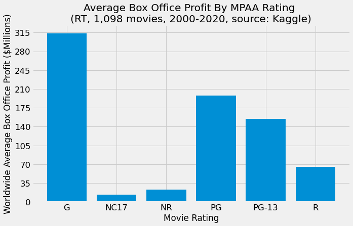
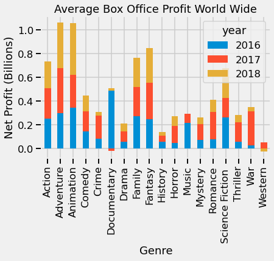

# Recommendations for the New Microsoft Movie Studio

**Authors**: *Ben Bowman, Nate Walter, Nina Vergara, Manav Kahlon*

## Overview

A one-paragraph overview of the project, including the business problem, data, methods, results and recommendations.


## Business Problem

Microsoft wishes to enter a market still growing internationally (even though domestic box office is delcining slightly) which reached $42.5 billion in 2019 before the pandemic.

Our task is to use data to explore the types of movies that are doing well at the box office, and then make appropriate recommendations to the head of the new Microsoft Studio.


## Data

* IMDB
    * imdb.name.basics.csv.gz
    * imdb.title.akas.csv.gz
    * imdb.title.basics.csv.gz
    * imdb.title.crew.csv.gz
    * imdb.title.principles.csv.gz
    * imdb.title.ratings.csv.gz

* Rotten Tomatoes
    * rt.movie_info.tsv.gz
    * rt.reviews.tsv.gz
    * rotten_tomatoes_movies.csv

* TheMovieDB
    * tmdb.movies.csv.gz
    
* The Numbers
    * tn.movie_budgets.csv.gz
    
* Box office Mojo
    * bom.movie_gross.csv.gz


## Methods

Our overall strategy is to merge the six IMDb datasets with TN, TMDb, and finally BOM. We want to compare various independent variables against box office returns. We can use domestic gross box office from the BOM and TN datasets, as well as worldwide gross receipts from TN. Then, by using the production budget values from TN, we can determine worldwide net receipts. Worldwide net receipts will be our dependent variable.

The two smaller RT datasets contain no movie titles that can be merged with the others (and only contain what is surmised to be gross domestic receipts). Therefore these datasets can be used for expoloratory purposes and to validate other results. The RT Kaggle dataset, however, can be merged with the larger datset for further exploration.

## Results

### Comparing box office Profit by MPAA Rating


When looking at the Worldwide Average Box Office Profit compared to Movie Rating some important results can be interpreted. We can see that the most profitable genre was `G` rated movies with the second most profitable genre being `PG` movies. From our visualization, it can be concluded that making a movie that has a rating that is either `G` or `PG` will lead to the greatest average box office profit. We are very confident that our results would apply to data in the real world since `G` and `PG` rated movies can be seen by the largest number of individuals, leading to more ticket sales. We would not recommend making `R` rated movies since the average net profit is significantly lower than `G` and `PG` movies leading to a greater risk of loss. 

### Comparing the Profits of 3 Different Genres by Month


While there is a wide range of available genres for movies to be, the two most profitable are `Adventure`, and `Animation`. We found that of all genres available the greatest and most consistent return's on investments are the ones mentioned earlier. We can see that from 2016-2018 the most profitable genres were `Adventure` and `Animation`.  While there was slight variation year over year the return was generally consistent for the two genres, making them the ones we would recommend for new movies to be. 

### Comparing Release Month to Net Profits


Looking at the graph comparing Release Month to Worldwide Net Box Office we can see that there is a very pronounced trend that appears in the data. The data starts weak early in the year then picks up as the year progresses peaking in July before falling sharply in the early fall and finally picking up at the end of the year. Based on this trend we would recommend that Microsoft aim to release a movie between May and July, and if unable to do so release a movie in November or December. 

## Conclusions

Based on our analysis, we recommend that Microsoft Studio should make and release a movie with the following conditions:

* **Make an animated movie (perhaps an animated adventure movie)**. Animated and adventure movies made the most profit in the last three years that we examined (2016-2018), and animated movies did best in 2018.
* **Make a movie with a G or PG MPAA rating**. These movies generate more profit than R-rated movies.
* **Release the movie in May, June, or July**. If this is not feasable, release the movie during the holiday season in November or December. Our data show definite swings in box office profits througout the year, with late spring/early summer and end of the year as boom periods.


## For More Information

Please review our full analysis in [our Jupyter Notebook](./Group_1_Technical_Notebook.ipynb) or our [<>](./DS_Project_Presentation.pdf).


## Repository Structure

```
├── README.md                           <- The README to provide a overview of our project
├── Group_1_Technical_Notebook.ipynb    <- The steps taken to acheive our endgoal
├── DS_Project_Presentation.pdf         <- PDF of our project presentation
├── data                                <- Sourced from an external source
└── images                              <- Images found online and pulled from our data
```

Source(s)
* [Second picture](https://www.pexels.com/photo/photo-of-man-holding-camera-3062541/)
