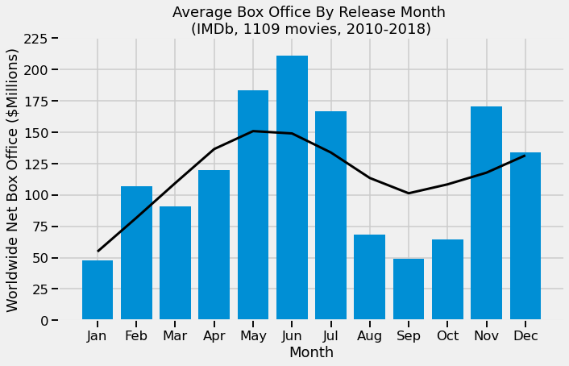

# Recommendations for the New Microsoft Movie Studio

**Authors**: *Ben Bowman, Nate Walter, Nina Vergara, Manav Kahlon*

## Overview

A one-paragraph overview of the project, including the business problem, data, methods, results and recommendations.


## Business Problem

Microsoft wishes to enter a market still growing internationally (even though domestic box office is delcining slightly) which reached $42.5 billion in 2019 before the pandemic.

Our task is to use data to explore the types of movies that are doing well at the box office, and then make appropriate recommendations to the head of the new Microsoft Studio.


## Data

* IMDB
    * imdb.name.basics.csv.gz
    * imdb.title.akas.csv.gz
    * imdb.title.basics.csv.gz
    * imdb.title.crew.csv.gz
    * imdb.title.principles.csv.gz
    * imdb.title.ratings.csv.gz

* Rotten Tomatoes
    * rt.movie_info.tsv.gz
    * rt.reviews.tsv.gz

* TheMovieDB
    * tmdb.movies.csv.gz
    
* The Numbers
    * tn.movie_budgets.csv.gz
    
* Box office Mojo
    * bom.movie_gross.csv.gz
    
Our overall strategy is to merge the six IMDb datasets with TN, TMDb, and finally BOM. We want to compare various independent variables against box office returns. We can use domestic gross box office from the BOM and TN datasets, as well as worldwide gross receipts from TN. Then, by using the production budget values from TN, we can determine worldwide net receipts. Worldwide net receipts will be our dependent variable.

The two smaller RT datasets contain no movie titles that can be merged with the others (and only contain what is surmised to be gross domestic receipts). Therefore these datasets can be used for expoloratory purposes and to validate other results. The RT Kaggle dataset, however, can be merged with the larger datset for further exploration.


## Methods

### Describe the process for analyzing or modeling the data. For Phase 1, this will be descriptive analysis.

***
Questions to consider:
* How did you prepare, analyze or model the data?
* Why is this approach appropriate given the data and the business problem?
***

## Results

Present your key results. For Phase 1, this will be findings from your descriptive analysis.

***
Questions to consider:
* How do you interpret the results?
* How confident are you that your results would generalize beyond the data you have?
***

Here is an example of how to embed images from your sub-folder:

### Comparing box office Profit by MPAA Rating


When looking at the Worldwide Average Box Office Profit compared to Movie Rating some important results can be interpreted. We can see that the most profitable genre was `G` rated movies with the second most profitable genre being `pg` movies. From our visualization, it can be concluded that making a movie that has a rating that is either `G` or `PG` will lead to the greatest average box office profit. We are very confident that our results would apply to data in the real world since `G` and `PG` rated movies can be seen by the largest number of individuals, leading to more ticket sales. We would not recommend making `R` rated movies since the average net profit is significantly lower than `G` and `PG` movies leading to a greater risk of loss. 

### Comparing the Profits of 3 Different Genres by Month


While there is a wide range of avaibale genres for movies to be, the three most profitable are `Adventure`, `Animation`, and `Fantasy`. We found that of all genres aviable the greatest and most consistent return's on investments are the ones mentined earlier. The data shows us that for a given month the net profit of the three generes will tend to be consistent, with silight variation based on certain months. 

### Comparing Release Month to Net Profits


Looking at the graph comparing release month to worldwide Net Box Office we can see that there is a very pronoucned trend that appears in the data. The data starts off weak in the ea

## Conclusions

Provide your conclusions about the work you've done, including any limitations or next steps.

***
Questions to consider:
* What would you recommend the business do as a result of this work?
* What are some reasons why your analysis might not fully solve the business problem?
* What else could you do in the future to improve this project?
***

## For More Information

Please review our full analysis in [our Jupyter Notebook](./dsc-phase1-project-template.ipynb) or our [presentation](./DS_Project_Presentation.pdf).

For any additional questions, please contact **name & email, name & email**

## Repository Structure

Describe the structure of your repository and its contents, for example:

```
├── README.md                           <- The top-level README for reviewers of this project
├── dsc-phase1-project-template.ipynb   <- Narrative documentation of analysis in Jupyter notebook
├── DS_Project_Presentation.pdf         <- PDF version of project presentation
├── data                                <- Both sourced externally and generated from code
└── images                              <- Both sourced externally and generated from code
```

Sources
* [Second picture](https://www.pexels.com/photo/photo-of-man-holding-camera-3062541/)
